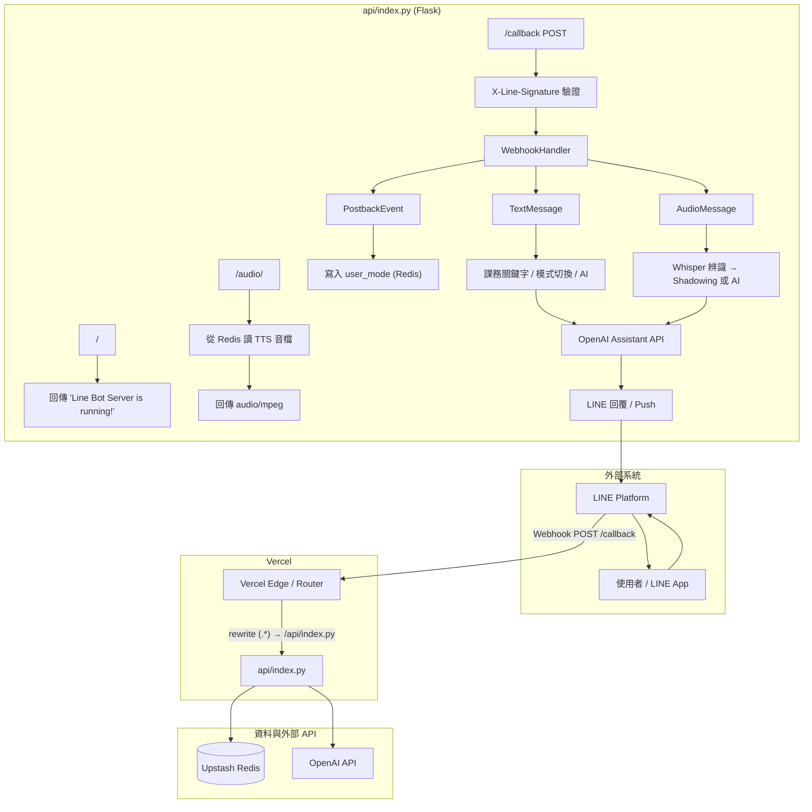
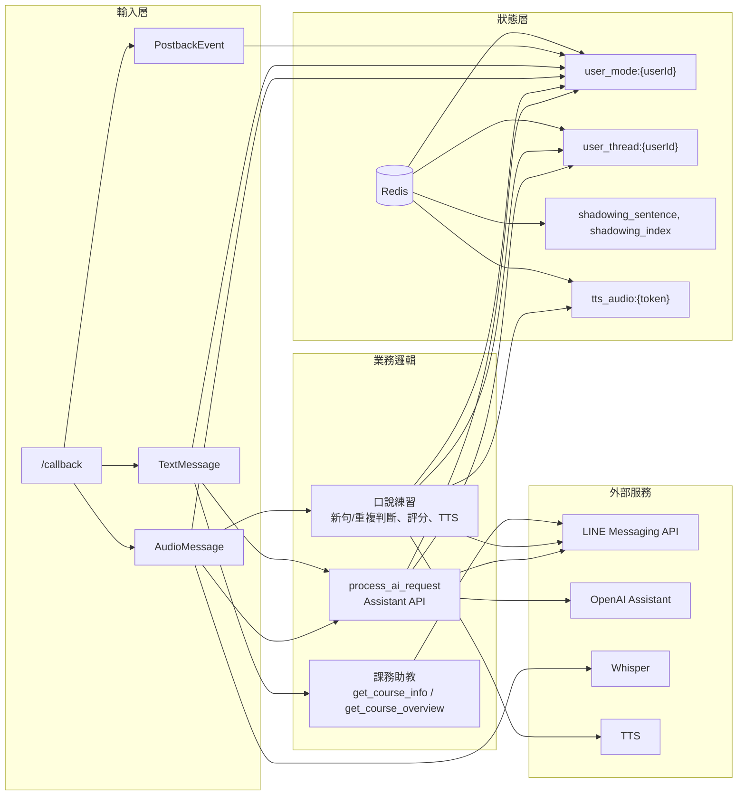
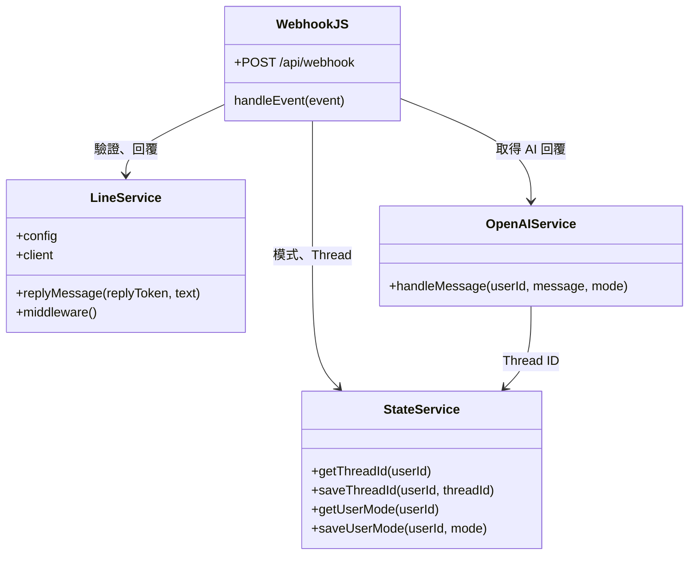
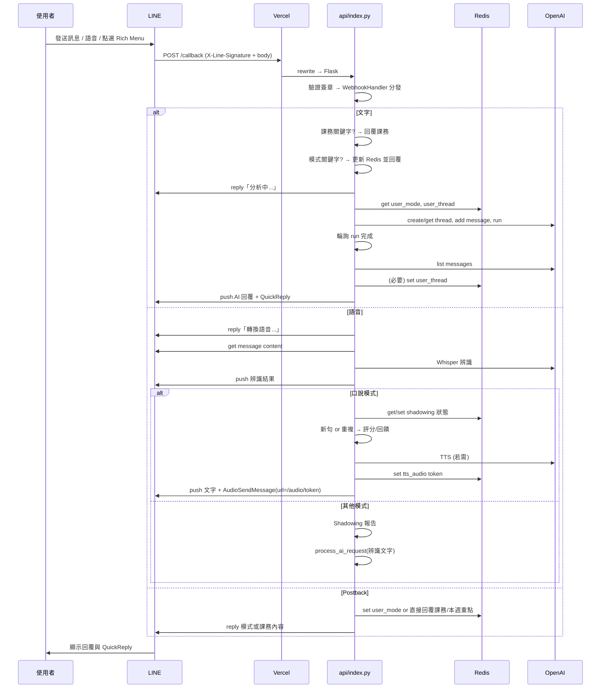

# LINE TCM Bot — 技術架構概覽

本文件描述專案的資料夾結構、模組關係、核心邏輯與從啟動到回應的完整執行流程。

---

## 1. 資料夾結構

```
line-tcm-bot/
├── api/                    # 後端進入點（Webhook / Serverless）
│   ├── index.py            # ★ 正式部署入口：Flask + LINE + OpenAI + Redis（Vercel 使用）
│   └── webhook.js          # 備用入口：Express + LINE SDK（Node 本地 / 舊版 Vercel 路徑）
├── services/               # Node 專用服務層（僅被 webhook.js 使用）
│   ├── line.js             # LINE API 封裝（回覆訊息、middleware）
│   ├── openai.js           # OpenAI Assistant API（Thread / Run / 輪詢）
│   └── state.js            # 使用者狀態 Mock（Thread ID、模式，記憶體儲存）
├── scripts/                # 一次性或維護用腳本
│   └── setup_rich_menu.js  # 以 Node 建立 LINE Rich Menu（上傳圖片、設為預設）
├── tests/                  # 測試
│   └── test_openai_service.js
├── assets/                 # Rich Menu 圖片等靜態資源（register_menu.py 使用）
├── docs/                   # 文件（本架構說明）
├── main.py                 # 本地 Flask 執行用（精簡版，與 api/index.py 邏輯類似）
├── register_menu.py        # 以 Python 建立 Rich Menu（上傳 2500x843 圖片、Postback 區塊）
├── vercel.json             # Vercel 路由：全部請求轉發至 /api/index.py
├── package.json            # Node 依賴與腳本（webhook、dev）
├── requirements.txt       # Python 依賴（Flask、line-bot-sdk、openai、upstash-redis 等）
├── .env / .env.example     # 環境變數
└── README.md
```

### 主要目錄職責簡述

| 目錄／檔案 | 職責 |
|------------|------|
| **api/** | 對外 HTTP 進入點。`index.py` 為目前 Vercel 實際使用的單一入口（Flask）；`webhook.js` 為 Node 版 Webhook，依 `vercel.json` 目前未作為主要入口。 |
| **services/** | 僅供 Node 版使用：LINE 發送、OpenAI 對話、使用者狀態。正式部署的 Python 版在 `api/index.py` 內直接整合 LINE / OpenAI / Redis，不經此目錄。 |
| **scripts/** | 維護用：以 Node 建立或更新 LINE Rich Menu。 |
| **tests/** | 單元或整合測試（例如 OpenAI 服務）。 |
| **根目錄** | 設定檔（`vercel.json`、`package.json`、`requirements.txt`）、環境變數範例、本地/備用入口（`main.py`、`register_menu.py`）與文件。 |

---

## 2. 模組關係圖

### 2.1 部署與請求流向（Vercel 實際使用）



### 2.2 功能模組與資料流（api/index.py 內部）



### 2.3 Node 版模組關係（api/webhook.js + services）



---

## 3. 核心邏輯

### 3.1 進入點 (Entry Point)

- **正式部署（Vercel）**  
  - `vercel.json` 將所有請求 `rewrite` 到 `/api/index.py`。  
  - 因此 **唯一 HTTP 進入點** 為 **`api/index.py`** 的 Flask 應用程式。

- **本地 Python**  
  - 可直接執行 `main.py` 或 `api/index.py`（若 `if __name__ == "__main__"` 或 `app.run()`），監聽本機 port，供 ngrok 等轉發給 LINE。

- **Node 版（目前非 Vercel 預設）**  
  - `package.json` 的 `main` 與 `dev` 指向 `api/webhook.js`；若改寫 `vercel.json` 指向 Node 函式，則進入點會是 `api/webhook.js` 匯出的 Express app。目前專案 **未** 如此設定。

### 3.2 驗證

- **LINE 簽章驗證**  
  - 在 `api/index.py` 的 `callback()` 中，以 `request.headers.get('X-Line-Signature')` 與 `request.get_data(as_text=True)` 交給 `line_webhook_handler.handle(body, signature)`；若拋出 `InvalidSignatureError` 則 `abort(400)`。  
  - 確保僅 LINE 平台發送的請求會被當成 Webhook 處理。

### 3.3 資料處理與狀態

- **狀態儲存**  
  - 使用 **Upstash Redis**（環境變數 `KV_REST_API_URL`、`KV_REST_API_TOKEN`）。  
  - 鍵值包括：`user_mode:{userId}`、`user_thread:{userId}`、`shadowing_sentence:{userId}`、`shadowing_index:{userId}`、`tts_audio:{token}`（TTS 暫存，TTL 約 10 分鐘）。

- **課務查詢**  
  - 純關鍵字比對：`get_course_info(message_text)` 辨識「評分／成績／課表／作業」等，回傳固定課務文案；Postback `action=course` 呼叫 `get_course_overview()` 回傳總覽。

- **口說練習 (Shadowing)**  
  - 僅在 `user_mode == "speaking"` 時啟用完整流程：  
    - 從 Redis 取當前練習句 `shadowing_sentence`，用 `_is_repeat_practice()` 判斷為「新句」或「重複練習」；  
    - 新句：輪流取 `TCM_EMI_SENTENCES`、寫回 Redis、產生 TTS 存 Redis、回傳文字 + 語音；  
    - 重複：`_score_shadowing()` 與 `_build_speaking_feedback()` 產出評分與建議；未滿 100 分再送同一句 TTS。  
  - 非口說模式下，語音仍會做 Whisper 辨識 + Shadowing 報告，再進入 AI。

- **AI 對話**  
  - `process_ai_request(event, user_id, text, is_voice)`：  
    - 從 Redis 讀 `user_mode`、`user_thread`；無 thread 則建立並寫回；  
    - 將使用者內容加上模式標籤與「回答末尾提供參考資料出處」等提示，寫入 Thread；  
    - 建立 Run 並輪詢至完成（最多約 8.5 秒）；  
    - 取最新 assistant 訊息，若為 `tcm` 模式則附加安全聲明，最後以 `text_with_quick_reply()` 推送給使用者。

### 3.4 「畫面」與使用者體驗

- 本專案為 **LINE Bot 後端**，沒有網頁 UI。  
- 「呈現」即 **LINE 聊天室內的訊息**：  
  - 文字（含 QuickReply：口說練習、寫作修改、課務查詢、本週重點）、  
  - 語音（TTS 的 `AudioSendMessage`）、  
  - 以及 Rich Menu（由 `register_menu.py` 或 `scripts/setup_rich_menu.js` 設定）。  
- 所有回覆皆透過 **LINE Messaging API**（`line_bot_api.reply_message` / `push_message`）送出。

---

## 4. 執行流程：從啟動到呈現

### 4.1 啟動階段（Vercel）

1. Vercel 載入專案，根據 `vercel.json` 將請求轉發到 `api/index.py`。  
2. Python 執行 `api/index.py`：  
   - 載入環境變數，初始化 Flask `app`、`LineBotApi`、`WebhookHandler`、`OpenAI`、`Redis`（若存在）。  
   - 註冊路由：`/`、`/audio/<token>`、`/callback`，以及 `@line_webhook_handler.add` 的 Postback、Text、Audio 處理函式。  
3. 收到 **GET /** 時，直接回傳 `'Line Bot Server is running!'`，無需 LINE 或 Redis。

### 4.2 收到 Webhook（使用者發訊）

1. 使用者在 LINE 發送訊息或點擊 Rich Menu。  
2. LINE 伺服器對 **Webhook URL**（例如 `https://xxx.vercel.app/callback`）發送 **POST /callback**，body 為 JSON，header 帶 `X-Line-Signature`。  
3. Vercel 將請求轉到 `api/index.py`，進入 `callback()`：  
   - 讀取 `body`、`signature`，呼叫 `line_webhook_handler.handle(body, signature)`。  
   - 驗證失敗則 `abort(400)`；成功則依事件類型分發。

### 4.3 事件分發與回應

- **Postback（例如 Rich Menu 點擊）**  
  - `handle_postback()`：解析 `data`（如 `mode=tcm`、`action=course`）。  
  - 若為 `action=course` / `action=weekly`，直接回傳課務總覽或本週重點。  
  - 若為 `mode=*`，寫入 `user_mode:{userId}` 到 Redis，再回覆「已切換至【xxx】模式」。

- **文字訊息**  
  - `handle_message()`：  
    1. 先查 `get_course_info(user_text)`，有則回傳課務並結束。  
    2. 若為「本週重點」「口說練習」「寫作修改」，則更新模式或回覆說明。  
    3. 其餘：從 Redis 取 `user_mode`，先 **reply**「正在以【xxx】模式分析中...」，再呼叫 `process_ai_request()`。  
    4. `process_ai_request()` 取得/建立 thread、送訊息、建立 run、輪詢、取回 assistant 回覆，必要時加安全聲明，最後 **push_message** 帶 QuickReply 的回覆。

- **語音訊息**  
  - `handle_audio()`：  
    1. 先 **reply**「正在轉換語音...」。  
    2. 用 LINE API 下載語音檔，寫入暫存檔，呼叫 **Whisper** 辨識。  
    3. **push** 辨識結果給使用者。  
    4. 若為 **口說模式**：走 Shadowing 流程（新句/重複、評分、TTS、回饋）。  
    5. 若非口說模式：產生 Shadowing 報告後，再呼叫 `process_ai_request()` 用辨識文字做 AI 回覆。  
    6. 語音回覆（TTS）透過 **GET /audio/<token>**：從 Redis 讀取 base64 音檔，解碼後以 `audio/mpeg` 回傳；LINE 以 `AudioSendMessage` 的 `original_content_url` 指向此 URL 播放。

### 4.4 生命週期簡圖



---

## 5. 小結

- **實際對外單一進入點**：`api/index.py`（Flask），由 `vercel.json` 指定。  
- **主要模組**：LINE Webhook 驗證與事件分發、Redis 狀態、課務關鍵字、口說 Shadowing（新句/重複、評分、TTS）、OpenAI Assistant + Whisper + TTS。  
- **資料流**：LINE → Vercel → Flask → Redis / OpenAI → LINE；語音播放經由 `/audio/<token>` 從 Redis 讀取 TTS 再回傳。  
- **Node 的 `api/webhook.js` 與 `services/`** 為另一套實作，目前未作為 Vercel 預設入口，可視為備用或本地測試用。

以上即為從啟動到「畫面」（LINE 聊天室訊息）的完整技術架構與執行流程。
